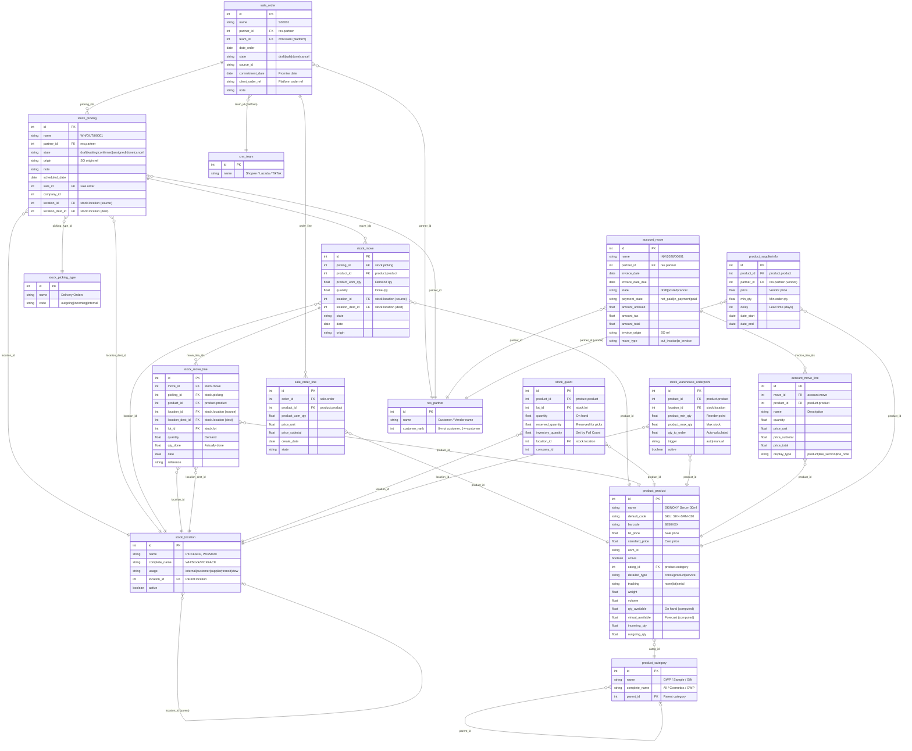
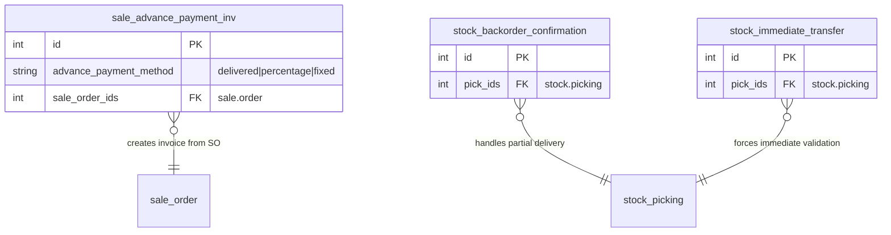

# WMS Pro — Odoo 18 ERD (Entity Relationship Diagram)

> **Version:** 4.2.0 | **Updated:** 2026-03-31 | **Models:** 19 (16 core + 3 wizards)

---

## System Overview

```
┌─────────────────────────────────────────────────────────────────┐
│                        WMS Pro (React)                          │
│  Dashboard │ Pick │ Pack │ Inventory │ Full Count │ Fulfillment │
└──────────────────────────┬──────────────────────────────────────┘
                           │ JSON-RPC / REST
                           ▼
┌─────────────────────────────────────────────────────────────────┐
│                      Odoo 18 Server                             │
│                                                                 │
│  ┌──────────┐  ┌──────────┐  ┌──────────┐  ┌──────────┐       │
│  │  STOCK   │  │  SALES   │  │ INVOICE  │  │  MASTER  │       │
│  │ 8 models │  │ 3 models │  │ 2 models │  │ 6 models │       │
│  └──────────┘  └──────────┘  └──────────┘  └──────────┘       │
│                                                                 │
│                    PostgreSQL 16                                │
└─────────────────────────────────────────────────────────────────┘
```

---

## Full ERD Diagram (Mermaid)



---

## Wizard Models (Transient)

Wizards are temporary models used for multi-step operations:



---

## WMS Function → Odoo Model Mapping

### STOCK Operations

| WMS Function | Models Used | Methods | Purpose |
|---|---|---|---|
| `fetchAllOrders()` | stock.picking, stock.move, sale.order, product.product | search_read, read | Load all pending deliveries |
| `confirmRTS()` | stock.picking, stock.move, stock.move.line, stock.quant, sale.order, account.move, sale.advance.payment.inv, stock.backorder.confirmation, stock.immediate.transfer | search_read, write, create, button_validate, action_confirm, action_post, process | Ready-to-ship: validate picking → create invoice → post |
| `createInternalTransfer()` | stock.picking, stock.picking.type, stock.move, stock.move.line, stock.location, stock.immediate.transfer | search_read, create, action_confirm, button_validate, process | Move stock between locations |
| `fetchInventory()` | stock.quant, product.product, stock.location | search_read, read | Load current stock levels |
| `fetchFullInventory()` | stock.quant, product.product | search_read | All warehouse stock (no location filter) |
| `fetchStockByLocation()` | stock.quant, product.product | search_read | Stock breakdown per location |
| `fetchStockForecast()` | stock.move, product.product | search_read | Incoming/outgoing predictions |
| `fetchStockHistory()` | stock.move.line | search_read | Movement audit trail |
| `fetchAllLocations()` | stock.location | search_read | List all internal locations |
| `getOrCreatePickfaceLocation()` | stock.location | search_read, create | Ensure PICKFACE location exists |

### Full Count (NEW)

| WMS Function | Models Used | Methods | Purpose |
|---|---|---|---|
| `applyFullCountAdjustments()` | product.product, stock.location, stock.quant | search_read, write, create, action_apply_inventory | Send counted qty → adjust stock.quant in Odoo |

### Sales & Invoicing

| WMS Function | Models Used | Methods | Purpose |
|---|---|---|---|
| `syncManualSalesOrder()` | sale.order, sale.order.line, res.partner, crm.team, product.product | search_read, create, action_confirm | Create SO from platform orders |
| `fetchSalesHistory()` | sale.order.line | search_read | Product sales trends |
| `fetchInvoices()` | account.move, account.move.line | search_read | Load invoice list |

### Master Data

| WMS Function | Models Used | Methods | Purpose |
|---|---|---|---|
| `fetchProducts()` | product.product | search_read | Active SKU catalog |
| `fetchProductDetail()` | product.product | read | Single product full detail |
| `fetchSupplierInfo()` | product.supplierinfo | search_read | Vendor pricing & lead times |
| `fetchProductCategories()` | product.category | search_read | Category tree |
| `fetchProductBrands()` | product.product | search_read | Distinct brand list |
| `fetchReorderRules()` | stock.warehouse.orderpoint | search_read | Auto-reorder settings |
| `createReorderRule()` | stock.warehouse.orderpoint | create | Set new reorder point |
| `updateReorderRule()` | stock.warehouse.orderpoint | write | Update min/max qty |
| `createGWPProduct()` | product.product | create | Create gift-with-purchase product |
| `setGWPInitialStock()` | stock.quant | search_read, write, create, action_apply_inventory | Set initial stock for GWP |

---

## Data Flow: Full Count → Odoo Adjustment

```
WMS React                              Odoo 18
─────────                              ───────

1. fetchInventory() ◀───────────────── stock.quant (quantity)
                                        product.product (sku, name)
   ┌─────────────────┐
   │ Create Session   │
   │ systemQty = qty  │
   │ countedQty = null│
   └────────┬────────┘
            │
2. Count    │  (localStorage only)
   ┌────────▼────────┐
   │ countedQty = 48  │
   │ systemQty  = 50  │
   │ variance   = -2  │
   │ variancePct = 4% │
   │ status = matched │
   │   or needs-recount│
   │   or variance-    │
   │     approved      │
   └────────┬────────┘
            │
3. Approve  │  applyFullCountAdjustments()
   ┌────────▼────────┐
   │ For each variance│──────────────▶ product.product.search_read
   │ item:            │                 → find product_id by SKU
   │                  │──────────────▶ stock.location.search_read
   │                  │                 → find location_id
   │                  │──────────────▶ stock.quant.search_read
   │                  │                 → find existing quant
   │                  │──────────────▶ stock.quant.write
   │                  │                 inventory_quantity = 48
   │                  │──────────────▶ stock.quant.action_apply_inventory
   │                  │                 → Odoo creates stock.move
   │                  │                 → quantity updated: 50 → 48
   └──────────────────┘

4. Result
   ┌──────────────────┐
   │ status: success   │
   │ applied: 12       │
   │ failed: 0         │
   │ → Close session   │
   │ → Unfreeze stock  │
   └──────────────────┘
```

---

## SO Flow × ERD (End-to-End Order Lifecycle)

```
Stage 1: ORDER                    Stage 2: CONFIRM
─────────────                     ────────────────
sale.order.create()               sale.order.action_confirm()
  └─ sale.order.line                └─ auto-creates:
       └─ product_id                     stock.picking (WH/OUT)
       └─ product_uom_qty                 └─ stock.move
       └─ price_unit                          └─ product_id
  └─ partner_id                               └─ product_uom_qty
  └─ team_id (platform)

Stage 3-5: PICK → PACK           Stage 6: RTS (Ready-to-Ship)
───────────────────               ──────────────────────────
WMS updates state only            stock.move.line.write(qty_done)
(localStorage + React)            stock.picking.button_validate()
                                    └─ stock.quant.quantity updated
                                    └─ stock.move → state: done
                                  sale.advance.payment.inv.create()
                                    └─ .create_invoices()
                                    └─ account.move created
                                    └─ account.move.action_post()

Stage 7: FULL COUNT               Stage 8: REORDER
─────────────────                  ────────────────
stock.quant.write                  stock.warehouse.orderpoint
  (inventory_quantity)               └─ product_min_qty
stock.quant.action_apply_inventory   └─ product_max_qty
  └─ Odoo adjusts quantity           └─ trigger: auto
  └─ Creates stock.move (adjust)     └─ qty_to_order (computed)
```

---

## Model Statistics

| Category | Models | Fields Used | Methods |
|---|---|---|---|
| **Stock** | 8 | 52 | search_read, write, create, button_validate, action_confirm, action_apply_inventory, process |
| **Sales** | 3 | 19 | search_read, read, create, action_confirm, create_invoices |
| **Accounting** | 2 | 21 | search_read, action_post |
| **Master Data** | 6 | 41 | search_read, read, create, write |
| **Total** | **19** | **133** | **12 unique methods** |
