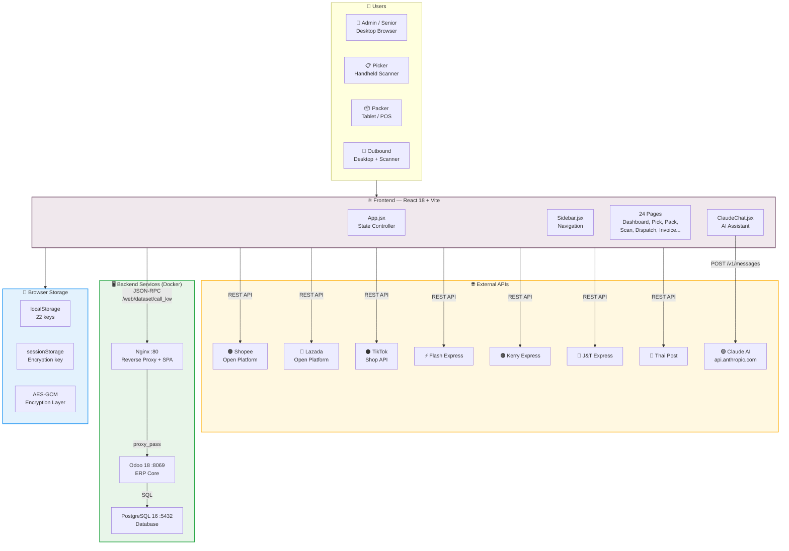
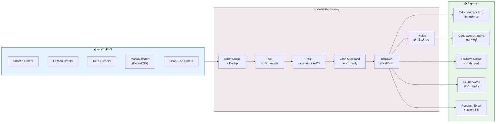
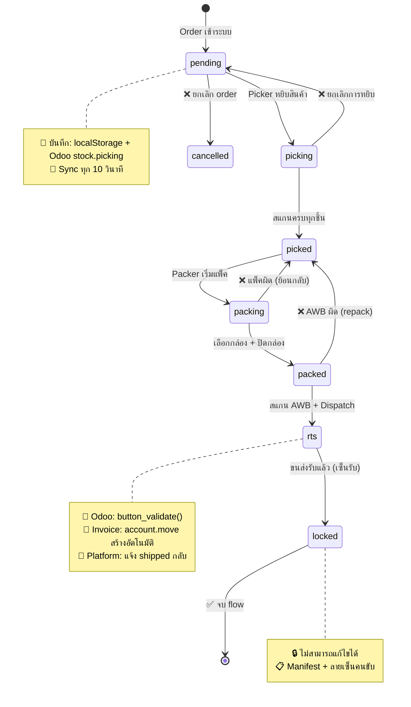
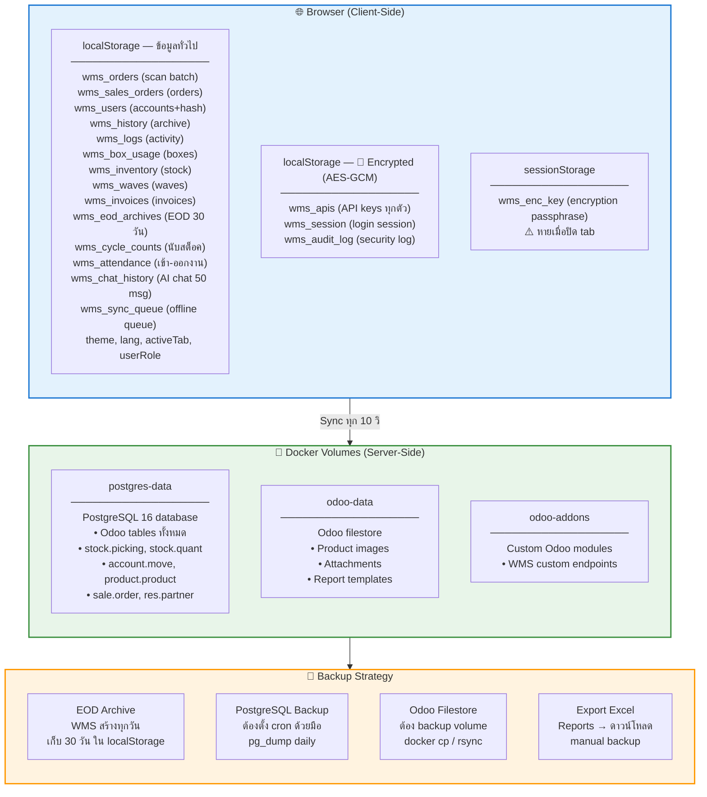
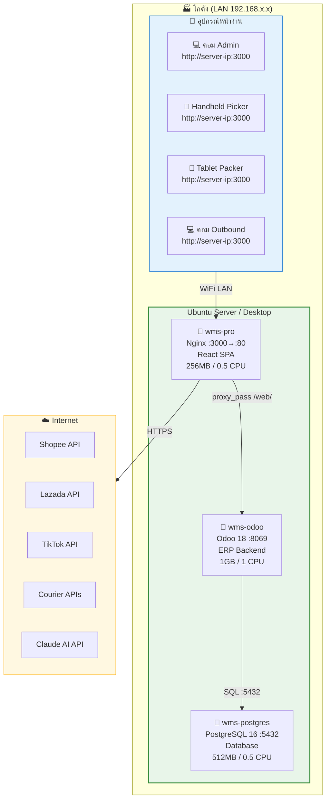
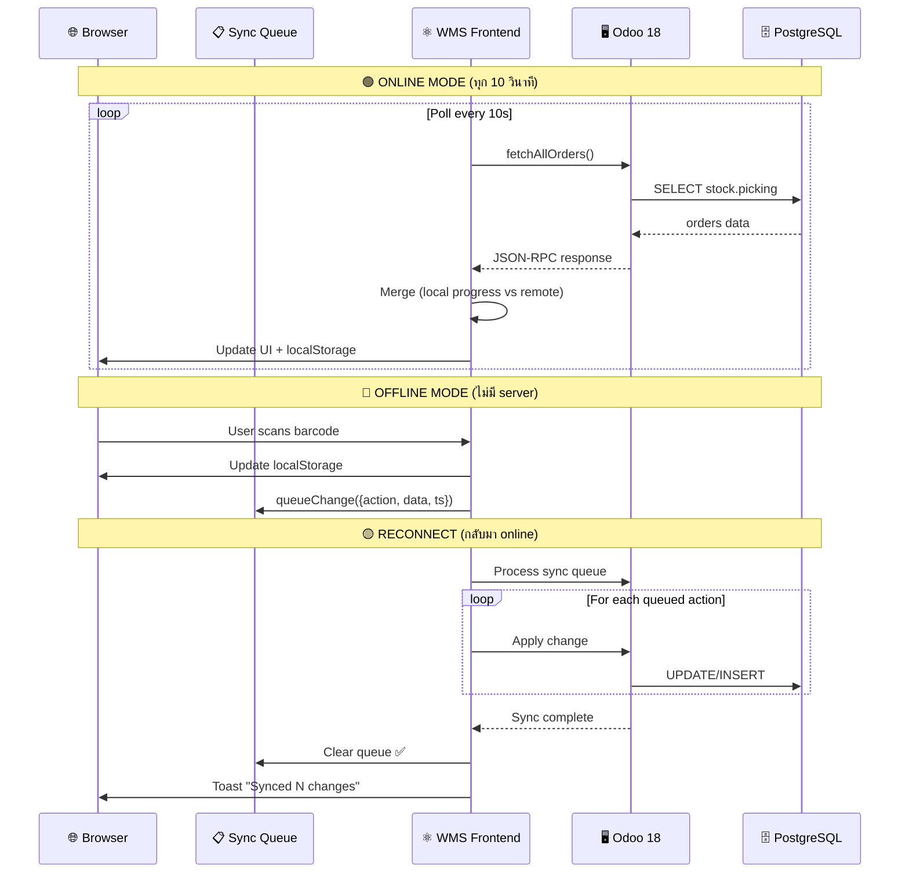
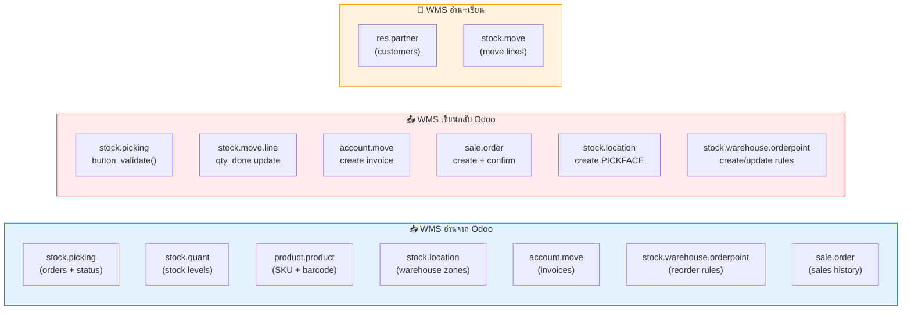
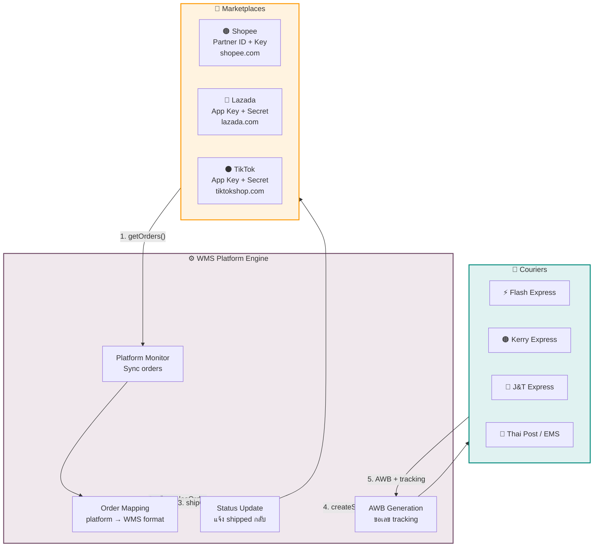
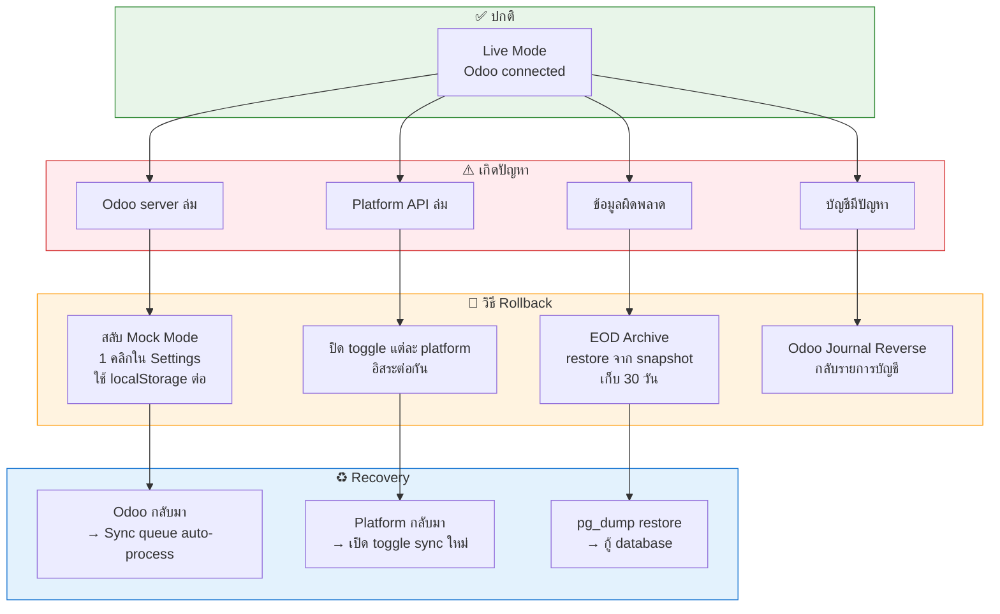

# KOB WMS Pro — System Architecture & Flow Diagrams

> **Deep Dive:** ทุก flow ของระบบ — ข้อมูลไหลไปไหน, วิ่งกลับ, ย้อนกลับ, บันทึกที่ไหน, สำรองที่ไหน, รันที่ไหน

---

## 1. ภาพรวมระบบ (System Architecture)

---

## 2. Data Flow — ข้อมูลไหลไปไหน

---

## 3. Order Lifecycle — วงจรชีวิต Order (ไหลไป + ย้อนกลับ)

---

## 4. Storage Map — บันทึกที่ไหน, สำรองที่ไหน

---

## 5. Network & Deployment — รันที่ไหน

---

## 6. Sync Flow — Online vs Offline

---

## 7. Odoo Data Model — Read/Write Direction

---

## 8. Security & Encryption Flow

```mermaid
graph TB
    subgraph LOGIN["🔐 Login Flow"]
        L1["User enters password"]
        L2["Check account lockout<br/>(5 attempts / 5 min)"]
        L3["First login?<br/>(empty password)"]
        L4["Hash: SHA-256<br/>+ random salt<br/>+ 10,000 iterations"]
        L5["Verify: constant-time<br/>comparison"]
        L6["Create session<br/>(30 min timeout)"]
        L7["Force password change"]

        L1 --> L2
        L2 -->|"not locked"| L3
        L3 -->|"yes"| L7
        L3 -->|"no"| L4 --> L5
        L5 -->|"match"| L6
        L5 -->|"fail"| L2
    end

    subgraph ENCRYPT["🔒 Data Encryption"]
        E1["Sensitive data<br/>(API keys, session)"]
        E2["AES-GCM encrypt<br/>via Web Crypto API"]
        E3["Key: PBKDF2<br/>from random passphrase"]
        E4["Stored: localStorage<br/>prefix 'enc:'"]
        E5["Passphrase: sessionStorage<br/>⚠️ lost on tab close"]

        E1 --> E2 --> E4
        E3 --> E2
        E3 --> E5
    end

    subgraph SESSION["⏱️ Session Management"]
        S1["Session active<br/>(30 min timeout)"]
        S2["Warning at 25 min"]
        S3["Auto-refresh<br/>on user activity"]
        S4["Destroy session<br/>clear localStorage keys"]

        S1 --> S2 --> S3 --> S1
        S1 -->|"expired"| S4
    end

    style LOGIN fill:#fce4ec,stroke:#C62828,stroke-width:2px
    style ENCRYPT fill:#e8eaf6,stroke:#283593,stroke-width:2px
    style SESSION fill:#fff3e0,stroke:#E65100,stroke-width:2px
```

---

## 9. Platform Integration Flow

---

## 10. Rollback & Recovery Flow

---

## Quick Reference — ตารางสรุป

### Ports

| Service | Port | URL |
|---------|------|-----|
| WMS (Nginx) | 3000 | `http://server-ip:3000` |
| Odoo 18 | 8069 | `http://server-ip:8069/web` |
| Odoo Longpoll | 8072 | WebSocket |
| PostgreSQL | 5432 | Internal only |
| Vite Dev | 5173 | `http://localhost:5173` |

### Docker Volumes

| Volume | Content | Backup Priority |
|--------|---------|-----------------|
| `postgres-data` | All Odoo data | 🔴 Critical — daily pg_dump |
| `odoo-data` | Images, files | 🟡 High — weekly rsync |
| `odoo-addons` | Custom modules | 🟢 Low — in git repo |

### localStorage Keys (22 keys)

| Key | Encrypted | Size Est. |
|-----|-----------|-----------|
| `wms_sales_orders` | No | 50-500 KB |
| `wms_apis` | **Yes** 🔐 | 1-2 KB |
| `wms_session` | **Yes** 🔐 | 0.5 KB |
| `wms_audit_log` | **Yes** 🔐 | 10-50 KB |
| `wms_users` | No | 1-5 KB |
| `wms_inventory` | No | 10-100 KB |
| `wms_logs` | No | 20-100 KB |
| `wms_chat_history` | No | 5-50 KB |
| `wms_eod_archives` | No | 50-200 KB |
| Other 13 keys | No | 1-10 KB each |

### Sync Intervals

| Target | Interval | Trigger |
|--------|----------|---------|
| Odoo orders | 10 sec | Auto-poll |
| Odoo inventory | 10 sec | Auto-poll |
| Platform orders | 60 sec | Auto-poll |
| Claude AI | On demand | User chat |
| EOD Archive | Daily | Manual / auto midnight |
